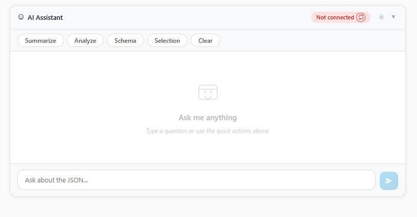

# Moka.Blazor.AI

A reusable Blazor AI chat panel component with streaming responses, editable messages, markdown rendering, and pluggable AI providers.

<p align="center">
  <a href="https://dotnet.microsoft.com"></a>
  <a href="https://github.com/jacobwi/Moka.Blazor.AI/blob/main/LICENSE"></a>
  <a href="https://github.com/jacobwi/Moka.Blazor.AI/actions"></a>
  <a href="https://www.nuget.org/packages/Moka.Blazor.AI"></a>
</p>

## Showcase



## Features

- **Streaming responses** — token-by-token streaming with typing indicator and stop/cancel
- **Edit & re-send** — edit any previous user message and re-send from that point
- **Three chat styles** — Bubble (modern), Classic (flat), Compact (minimal) — switchable at runtime
- **Quick actions** — configurable prompt buttons for common tasks
- **Markdown rendering** — assistant responses rendered as Markdown via Markdig
- **Settings panel** — model, temperature, max context, streaming toggle, chat style
- **Token tracking** — estimated token count and context window usage
- **Connection status** — auto-detect backend availability with retry
- **Theming** — light, dark, and auto modes via CSS variables
- **Pluggable providers** — OpenAI-compatible, Ollama, ONNX Runtime, or any custom `IChatClient`
- **Context builder** — `IAiContextBuilder` interface for domain-specific context injection
- **Multi-target** — supports .NET 9 and .NET 10

## Packages

| Package | Description |
|---------|-------------|
| [Moka.Blazor.AI](https://www.nuget.org/packages/Moka.Blazor.AI) | Core chat panel component and services |
| [Moka.Blazor.AI.Onnx](https://www.nuget.org/packages/Moka.Blazor.AI.Onnx) | ONNX Runtime GenAI provider for embedded/offline models |

## Installation

```bash
dotnet add package Moka.Blazor.AI
```

## Quick Start

### 1. Register services

```csharp
// Program.cs
builder.Services.AddMokaAi(options =>
{
    options.Provider = AiProvider.OpenAiCompatible;
    options.Endpoint = "http://localhost:1234";      // LM Studio
    options.DefaultModel = "qwen2.5-3b";
});
```

### 2. Add the component

```razor
@using Moka.Blazor.AI.Components

<MokaAiPanel Title="AI Assistant" />
```

### 3. Configure a provider

**OpenAI-compatible (LM Studio, vLLM):**

```csharp
builder.Services.AddMokaAi(options =>
{
    options.Provider = AiProvider.OpenAiCompatible;
    options.Endpoint = "http://localhost:1234";
    options.DefaultModel = "qwen2.5-3b";
});
```

**Ollama:**

```csharp
builder.Services.AddMokaAi(options =>
{
    options.Provider = AiProvider.Ollama;
    options.DefaultModel = "llama3.2";
});
```

**ONNX Runtime (embedded, no server):**

```bash
dotnet add package Moka.Blazor.AI.Onnx
```

```csharp
builder.Services.AddMokaAiOnnx(@"C:\models\phi-3-mini-onnx");
```

**Custom `IChatClient`:**

```csharp
builder.Services.AddMokaAi(myCustomChatClient);
```

## Parameters

| Parameter | Type | Default | Description |
|-----------|------|---------|-------------|
| `Title` | `string` | `"AI Assistant"` | Panel header text |
| `SystemPrompt` | `string` | `"You are a helpful..."` | System prompt for the AI |
| `QuickActions` | `IReadOnlyList<AiQuickAction>` | `null` | Quick action prompt buttons |
| `ActionsExtra` | `RenderFragment` | `null` | Custom toolbar content |
| `Placeholder` | `string` | `"Ask a question..."` | Input placeholder text |
| `MessagesHeight` | `string` | `"350px"` | Messages area height |
| `ShowQuickActions` | `bool` | `true` | Show/hide quick action buttons |
| `ChatStyle` | `ChatStyle` | `Bubble` | Visual style (Bubble, Classic, Compact) |
| `ThemeAttribute` | `string` | `""` | Theme (`"light"`, `"dark"`, `""`) |

## Chat Styles

| Style | Description |
|-------|-------------|
| **Bubble** | Modern messaging with rounded bubbles, avatars, and gradient send button |
| **Classic** | Flat messages with role labels and subtle borders |
| **Compact** | Minimal layout optimized for side panels and small spaces |

## Context Builder

Implement `IAiContextBuilder` to inject domain-specific context into prompts:

```csharp
public class MyContextBuilder : IAiContextBuilder
{
    public string BuildContext(AiChatOptions options)
    {
        return "Current user is logged in as admin. Database has 1,234 records.";
    }
}
```

Register it:

```csharp
builder.Services.AddScoped<IAiContextBuilder, MyContextBuilder>();
```

The AI chat service automatically includes the context in every request.

## Public API

| Method | Description |
|--------|-------------|
| `SendToAi(string text)` | Send a message to the AI and stream the response |
| `IsSending` | Whether a message is currently being processed |
| `Messages` | Read-only list of conversation messages |

## Theming

Apply themes via the `ThemeAttribute` parameter or the `[data-moka-ai-theme]` CSS attribute:

```razor
<MokaAiPanel ThemeAttribute="dark" />
```

Override CSS variables for custom themes:

```css
[data-moka-ai-theme="custom"] {
    --moka-ai-color-bg: #1a1a2e;
    --moka-ai-color-text: #e0e0e0;
    --moka-ai-color-primary: #0ea5e9;
    --moka-ai-color-border: #333;
}
```

## Project Structure

```
src/
  Moka.Blazor.AI/              # Core library (NuGet package)
    Components/                 # MokaAiPanel, MokaAiSettingsPanel
    Services/                   # AiChatService, IAiContextBuilder
    Models/                     # AiMessage, AiChatOptions, AiQuickAction, ChatStyle
    Extensions/                 # AddMokaAi() DI registration
    wwwroot/css/                # moka-ai.css (theming via CSS variables)
  Moka.Blazor.AI.Onnx/         # ONNX Runtime GenAI provider
    Extensions/                 # AddMokaAiOnnx() DI registration
    Models/                     # OnnxAiOptions
docs/                           # MokaDocs documentation site
```

## Build & Test

```bash
# Build entire solution
dotnet build

# Pack NuGet
dotnet pack -c Release -o nupkgs
```

## Related Projects

- [Moka.Blazor.Json](https://github.com/jacobwi/Moka.Blazor.Json) — High-performance Blazor JSON viewer/editor with `Moka.Blazor.Json.AI` integration

## Documentation

Full documentation at [jacobwi.github.io/Moka.Blazor.AI](https://jacobwi.github.io/Moka.Blazor.AI/)

## License

MIT
